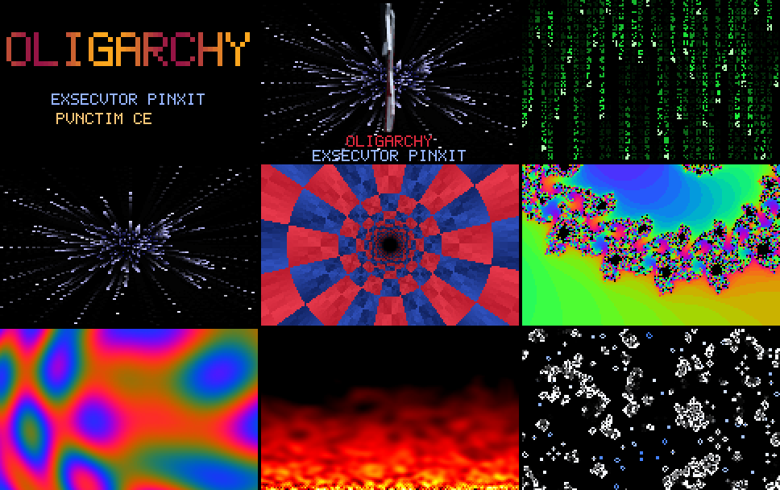

# somnium — a screensaver engine in Exsecutor

Status: **written, `[UNTESTED]` as Exsecutor.** `examples/somnium/` and
`tests/programs/somnium_*/` were written in an environment with no `fasmg`:
the proxy refused `flatassembler.net`, and running an unvetted prebuilt
binary was declined. So **no `exsc` has compiled these files, and no binary
built from them has run** — not the reference build, not the C build.

What *has* run:

- **The independent oracle**, `prototypes/somnium_oracle.py`. It wrote every
  `expected.out` under `tests/programs/somnium_*/`, and its frames were
  looked at (section 7).
- **The oracle's copy of the 3D engine.** It is byte-identical to
  `tests/programs/signaculum/expected.out`, all 786,432 pixels' bytes, on the
  stock model. That was checked before the logo was built on it.
- **The C host, `examples/somnium/hospes.c`.** It compiles clean under gcc
  and clang with `-Wall -Wextra -Wpedantic`, and was exercised against a
  stand-in `exs_initium` written to the same ABI (section 6).

The first `tests/run.sh` on a machine with the toolchain is the measurement
this document is waiting for. Where the sources lean on a construct,
section 8 names the tree program that already exercises it. That is evidence
the construct compiles; it says nothing about whether this program does.

The consumer is Oligarchy's `custom.screensaver` (`modules/screensaver/`
there). It pipes the engine into a fullscreen viewer when hypridle decides
the session is idle.



## 1. What it is

One program, `somnium`, holding nine effects ("somnia"):

| id | name | what | state across frames |
|---|---|---|---|
| 0 | `plasma` | four sine waves summed per pixel through a three-phase palette | none (a function of `t` and the seed) |
| 1 | `ignis` | heat-diffusion fire from two noise rows under the picture | the 160 × 102 heat field |
| 2 | `vita` | Conway's Life on a 160 × 100 torus, coloured by age, fading trails | two 16,000-cell boards and the frame |
| 3 | `pluvia` | digital rain: 40 × 20 cells of 3 × 4 glyphs, falling heads, trails | a `structura Pluvia` |
| 4 | `stellae` | warp starfield: 256 stars, a perspective *table*, streaks | a `structura Stellae` and the frame |
| 5 | `cuniculus` | the demoscene tunnel in the logo's crimson and navy | angle and depth tables, built at frame 0 |
| 6 | `abyssus` | Mandelbrot deep zoom into the Seahorse Valley, f64, 720-frame cycle | a phase counter |
| 7 | `titulus` | the title card: rain flies into **OLIGARCHY**, then **EXSECVTOR PINXIT** and **PVNCTIM CECINIT** type in; 400-frame cycle | a phase counter and the frame (trails) |
| 8 | `signum` | the Exsecutor logo turning in the starfield, **rendered by `examples/signaculum/forma.exsc`, unmodified** | the stars, the model, the engine's 512² frame and z-buffer |

It reads one request on stdin and writes frames on stdout: **raw rgb24,
160 × 100, row-major, no header, 48,000 bytes a frame.** The host tells its
viewer the geometry; mpv's `rawvideo` demuxer takes exactly this.

**The Latin.**

- *Exsecutor pinxit*: "Exsecutor painted it", the painter's signature on a
  canvas.
- *Punctim cecinit*: "Punctim sang it". HydraModem's melody profile, which
  `examples/hydramodem/melos*.exsc` transmits byte for byte, is Punctim's.

Both are cut in the classical alphabet, V for U. OLIGARCHY is the name and
stays as spelled.

## 2. Why the engine is shaped like this

**No ambient time, no ambient entropy (spec §1, §9.3).** In every other
implementation, a screensaver is a function of the clock and a random
source. Here time is the frame index the engine counts, and the only entropy
is a 32-bit seed in the request. So the same request writes the same bytes
on every machine, and a screensaver can be pinned by a golden file (section
5). The host is free to seed from its clock; that is the host's ambient
state, entering through the one declared door.

**160 × 100, because of the runtime.** The only way arbitrary bytes reach
stdout is `Scriptor.scribe_octeto`, and `compiler/x86_64/prelude/prelude.asm`
makes it one `write(2)` per byte: 48,000 syscalls a frame. The C build's
host (section 6) removes that cost without touching the source. 16:10 is
also the Framework 16's own aspect.

**Integers, except where a float is the point.** Eight somnia are integer
arithmetic, which takes the rounding-mode question away from the oracle
entirely. `abyssus` (and `signum`'s rotation and the engine under it) are
f64 on purpose, so that spec §5.4's float path is on screen. They keep the
oracle exact the way `examples/pictura/` does: one IEEE operation at a time,
in the order written, under nearest-even.

**What the language lacks, and how the program does without it:**

| missing (spec §5.4, `[OPEN]`) | used instead |
|---|---|
| `*%` (wrapping multiply) | xorshift32: xor and shifts only |
| remainder, bitwise and | `sicut u8` for mod 256; the shift-discard idiom for a bit, e.g. `(t8 sursum 5) deorsum 5` for mod 8 |
| integer division | shifts for powers of two; `(b * 158) deorsum 8` to scale a byte into a range; `reciproca()` = 8192 / (z + 1) as a **table** for the starfield's perspective; the tunnel's depth `2048 / r` found **bit by bit** (largest d with d²r² ≤ 2048²) |
| sine, arctangent, square root | frozen tables: `sinus()` and `tangentes()` (one octant, searched by multiplication); the plasma's rings go by distance squared |
| signed arithmetic | `distantia(a, b)` = \|a − b\|; a byte `o` meaning `o − 128`, projected as magnitude plus side; `t * 252` for `−4t mod 256` |
| a seventh argument (the reference backend's limit, `backend_fasmg/emit.inc`) | state grouped into `structura Pluvia` and `Stellae`, borrowed once |
| re-passing a `&mutabilis` parameter | not needed: every borrow is taken from `machina`'s own locals, one call deep. That is why `signum` is three calls (`signum_rota`, `signaculum_pingue`, `signum_compone`) and not one |

## 3. The request

17 bytes, then end of input:

| bytes | field | meaning |
|---|---|---|
| 0..4 | `"SOM1"` | magic, with the format version in its last byte |
| 4 | `somnium` | 0..8, the table in section 1 |
| 5..9 | `praetermitte`, u32 LE | frames advanced and not written (a warm fire, a filled sky) |
| 9..13 | `tabulae`, u32 LE | frames written; `0xFFFFFFFF` is "until the pipe closes" |
| 13..17 | `semen`, u32 LE | the seed; 0 is xorshift32's fixed point and becomes `0x9E3779B9` |

**Somnium 8 alone carries more.** The 3D engine's 44,801-byte EXSG model
(`tests/data/signaculum_mesh.bin`, shipped by the flake at
`share/somnium/signaculum_mesh.bin`) follows the 17 bytes. Its magic and its
two counts are checked before any frame is rendered: they are exactly what
`signaculum_pingue` would refuse with status 1 or 2.

**Exit status:**

- **0**: every requested frame was written.
- **1**: the request was refused (short, long, wrong magic, unknown
  somnium, bad model) and nothing was written.
- **2**: a frame was not taken. This is reachable only with SIGPIPE
  ignored. By default a closed pipe kills the process at the write, which is
  how the host stops a screensaver. The runtime's SIGPIPE behaviour is
  already `[OPEN]` in `docs/design/runtime.md`.

The request is read whole, and checked for its end, **before a frame is
rendered**.

Why a request on stdin rather than arguments: the engine's capability is
`ambitus`, the standard streams, and nothing else (spec §4.6). The syscall
surface of the reference build is `read(0)`, `write(1)` and `exit_group`.

## 4. The 3D engine, animated without touching it

`signaculum_pingue` takes its rotation as nine words of its input stream:
R = Rx(pitch) · Ry(yaw), on the 2⁻²³ grid, at bytes 20..56. So:

1. **`signum_rota`** rewrites those nine words for this frame's yaw. The
   yaw's sine and cosine come off `sinus()` in f64. The pitch terms
   cos p = R11 and sin p = R21 are read back out of the stream, so the model
   keeps the tilt it was baked with. Back onto the grid, the value is
   truncated toward zero (`sicut i64`, the rule forma.exsc's bounding boxes
   use) and written as two's complement.
2. **`machina`** calls `signaculum_pingue(exsg, magnum, zb)` into a
   512 × 512 frame and f64 z-buffer it owns: 2.8 MB, under the 8 MiB stack,
   as `signaculum.exsc`'s pump already is.
3. **`signum_compone`** takes rows 80..400 and columns 96..416 of that
   frame into an 80 × 80 box. Each output pixel is the mean of the 4 × 4
   engine pixels under it: an exact box filter, a shift and no division. A
   sample in the engine's ground colour takes the star behind it, so the
   logo sits in the sky rather than on a square. The captions go under it.

The per-face shading is baked for the hero view and does not follow the
turn; it reads as a lit texture. One turn is 256 frames.

**The oracle's engine is the engine's.** `prototypes/somnium_oracle.py`'s
`signaculum_pingue` is `prototypes/signaculum_oracle.py`'s arithmetic, with
the numpy lanes written out as scalars. Lane l of a whole-acy add is one f64
add, so the bits are the same. On the stock model its output equals
`tests/programs/signaculum/expected.out` byte for byte, all 786,432 bytes.
That was checked before any `signum` golden was written.

## 5. The fixtures

All seventeen compile the same twelve files in the same order:

```
somnium plasma ignis vita pluvia stellae cuniculus abyssus titulus
../signaculum/forma signum machina
```

That is also the order in which `flake.nix` compiles `packages.somnium` and
`packages.somnium-c`, so the unit tested is the unit shipped.

| directory | request | checks |
|---|---|---|
| `somnium_plasma` | plasma, skip 37, write 2 | the effect; skipping a stateless somnium lands on the same `t` |
| `somnium_ignis` | ignis, skip 60, write 1 | diffusion, cooling, wrap, palette, 19,520 draws in order |
| `somnium_vita` | vita, skip 23, write 2 | fill, four injections, torus, age palette, trails |
| `somnium_semen_nihil` | plasma, seed 0 | the zero-seed substitution |
| `somnium_pluvia` | rain, skip 40 | heads, restarts, glyph bits, dimming |
| `somnium_stellae` | stars, skip 30 | the reciprocal table, the signed-by-side projection and its bounds, rebirth, streaks |
| `somnium_cuniculus` | tunnel, skip 3 | both frame-0 tables (every pixel depends on both) |
| `somnium_abyssus` | zoom, frame 300 | the f64 path: 300 scale multiplies, a 171-iteration budget, `dum … terminus` |
| `somnium_titulus` | title, frame 228 | the font, the locked word, the shimmer, one inscription whole and one half typed |
| `somnium_titulus_volatus` | title, frame 62 | the blocks in flight: the five-round seeding, the easing |
| `somnium_signum` | logo, frame 20, + model | `signum_rota`, the engine, the box filter over the stars, the captions |
| `somnium_ignotum` | somnium 9 | refused, exit 1, no output |
| `somnium_brevis`, `_longa`, `_magia` | 16 bytes, 18 bytes, `"SOM2"` | refused |
| `somnium_signum_brevis`, `_magia` | model one byte short; model magic `EXSH` | refused |

**The refusal fixture moved.** `somnium_ignotum` used somnium 3, which is
now `pluvia`, so it uses 9. The four original effect goldens were
regenerated after the dispatch was rewritten and are byte-identical to the
committed ones.

None of these directories carries `cross=yes` or `c-differentia=`. They are
in the differential phase by default: the C backend must agree with the
reference on every one, the f64 ones included. **The program floors in
`tests/run.sh` were not raised**, because a floor is set to a measured count
and nothing was measured.

## 6. Two builds, and the GPU

**`packages.somnium`, the reference build.** exsc to fasmg: freestanding, no
libc, syscall surface `read`/`write`/`exit_group`, auditable under
`--potestates Mundus,ambitus`. This is the build the language's claims are
about. Its cost is one `write(2)` per output byte.

**`packages.somnium-c`, and `lib.buildExsecutorCProgram`.** The same unit
goes through `exsc --emitte c` (library mode), with
`examples/somnium/hospes.c` as its host. That host keeps the records, the
abort line and MXCSR `0x1F80` of `tests/c/exsrt_shim.c`, and changes one
thing: output collects in a buffer of exactly one frame and leaves in one
`write(2)`. Input is buffered too, which matters for the 44,801-byte model.

The build is the differential suite's `-std=c11 -O2`, plus
`-ffp-contract=off -fno-fast-math` stated explicitly. Clang's default is
`-ffp-contract=on`, and with an FMA-capable `-march` it would fuse `a*b+c`
and move a float somnium's last bit. `cflags` carries the machine flags:
Oligarchy defaults to `-march=x86-64-v3 -mtune=znver4` for the Framework 16's
Ryzen 7040. The C unit is portable C11 for the §9.5 C rows
(`x86_64-linux`, `riscv64-linux`); the N64 row's 32-bit `mensura` would trap
a long-running frame counter, so it is not offered. This build links libc
and is outside the syscall audit, and says so.

**Measured about the host, with a stand-in program:**

- 3 frames go out in 3 `write(2)` calls, against 144,000 the reference
  would make.
- A 70,000-byte input takes 3 `read(2)` calls.
- The bytes are exact.
- A consumer closing the pipe after one frame ends the process with
  SIGPIPE (status 141).

What the real program's frame rate is on either build is `[UNTESTED]`.
Oligarchy's `.#screensaver-tests` prints it per effect per build.

**The AMD GPU, stated exactly.** Exsecutor has no GPU code generation for a
parallel loop yet. There is no `@nucleus` and no `apud machina`, and
`quisque`, the declared-independent loop, lowers to the same CFG as `per`
(`docs/design/lowering.md`). The one device path, `tools/amd-dispatch/`,
runs a C unit as a **single workitem**. That makes it a same-bits
certificate, not a speed path: octonaria's 1.5 MB took 0.95–1.7 s there. So
the GPU's share today is the viewer's. mpv scales the 160 × 100 frame and
presents it through its default `gpu-next` output, on the 780M iGPU the
compositor already renders on (Oligarchy unsets `DRI_PRIME` for it). The
per-pixel loops of `plasma`, `cuniculus`'s render pass, `abyssus` and
`signum_compone` are independent by construction. They are the ones to
declare `quisque` once a backend can dispatch it; not before, because no
program in the tree compiles `quisque` today, and this one is already
unmeasured enough.

## 7. What the oracle found, before any Exsecutor ran

Written down because each is the "green check that exercised nothing" shape,
or its cousin, the wrong answer that would have looked plausible:

- **vita's injection never landed.** A raw byte is under 158 and under 98
  about 24% of the time, and on the fixture's seed none of four attempts
  fitted. It now scales a byte into range, and every attempt lands.
- **titulus's rain fell down four columns.** xorshift's first rounds from
  neighbouring seeds share their high bits. It now takes five rounds before
  the first draw.
- **titulus's dissolve overflowed a byte.** The fade was `(64 − k) × 4`,
  which is 256 at k = 0. In the program, `sicut u8` would have made that
  frame's blocks black rather than trapping. The oracle, which builds a
  `bytearray`, refused the value. It is `(63 − k) × 4`.

Looking is not a test and is recorded as what it is.
`prototypes/somnium_oracle.py png` and `apng` render any frame or run of
frames at any nearest-neighbour zoom. `docs/images/somnium_tabulae.png` is
the contact sheet above.

## 8. Constructs, and where the tree already runs them

| construct | used in | already exercised by |
|---|---|---|
| `&mutabilis acies` parameters, `(*p)[i]` | every somnium | `examples/signaculum/forma.exsc`, `examples/hydramodem/auditus.exsc` |
| `&mutabilis structura` with array fields, `(*p).f[i]` | `pluvia`, `stellae` | `examples/streamdb/lector_streamdb.exsc` (`Arbor`) |
| a function returning an array literal as a table | `sinus` `reciproca` `tangentes` `formae` … | `examples/hydramodem/modulator.exsc` |
| `aut`, `sursum`, `deorsum` on `u8`/`u32`/`u64` | throughout | `tests/programs/redundantia/`, `tests/ir/bitwise.ir` |
| narrowing `sicut` to `u8` | throughout | `tests/programs/angusta/`; from `mensura`/`u32`/`u64` the same `trunc`, `[UNTESTED]` from source until this runs |
| f64 → i64 and i64 → f64 `sicut` | `signum_rota` | `examples/signaculum/forma.exsc` |
| `dum … terminus` | `abyssus` | `examples/hydramodem/receptor.exsc` |
| `per` with a runtime bound, and from 1 | `machina`, `abyssus`, `cuniculus` | `examples/hydramodem/modulator.exsc` (a runtime bound); a literal start other than 0 is `[UNTESTED]` |
| ~3 MB of `[0; N]` locals | `machina` | `examples/signaculum/` (2.9 MB in its pump) |
| `Lector.lege_octeto`, `Scriptor.scribe_octeto` | `machina` | `examples/signaculum/`, `examples/pictura/` |

Shadowing an ordinary name in an inner block is allowed
(`docs/design/checker.md`), so the reused loop names are not a risk.

## 9. Open

- `[UNTESTED]`: everything in `examples/somnium/` as Exsecutor (the status line).
- `[UNTESTED]`: frame time on either build. Oligarchy's gate reports it.
- `[OPEN]`: a bulk-write prelude primitive, which would give the reference
  build what `hospes.c` gives the C one. Reported to
  `compiler/x86_64/prelude/`'s owner.
- `[OPEN]`: `quisque` on the independent pixel loops, when a backend can
  dispatch it (section 6).
