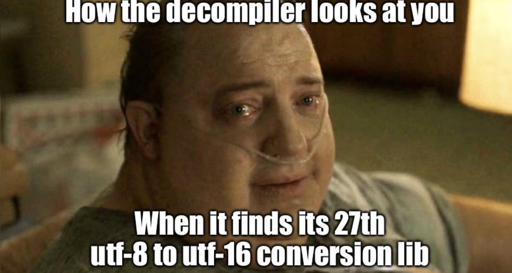

# examples/utf16/

Twenty-seven UTF-8 to UTF-16 converters in Exsecutor, one contract, one driver,
one oracle. They are not twenty-seven ways to get a different answer: every one
of them is held byte for byte to the same Python-codec output, on valid and
ill-formed input alike. What differs is *how*: how a sequence is recognised, how
a pass is structured, how stages are connected, how a fault would be caught.



*The mood of this directory.* `tools/identify.py` is as close to a decompiler as
the repository has: it recognises all 27 of these, and recovers no source. The
image was supplied by the repository owner. Its origin and licence are not
recorded here, so treat it as not covered by this repository's licence.

## The contract

`contractus.exsc` is the interface, and the only file all 27 share besides the
driver. A library is one pure file (no `poscit`, no allocation, no stream)
defining

```text
publica functio converte(fons: acies<u8, 4096>, n: mensura,
                         scopus: &mutabilis acies<u16, 4096>,
                         modus: u8) -> Exitus
```

It reads `fons[0..n)` as UTF-8 and writes UTF-16 code **units** (values, not
bytes) to `scopus[0..unitates)`. Byte order is not its business: the library
never serialises, so it cannot get it wrong (spec §1).

Two modes. `modus_stricte` stops at the first ill-formed subpart, reports its
byte offset in `Exitus.positio`, and leaves the conversion of everything *before*
it in `scopus`. `modus_substitue` never fails: each **maximal subpart** of an
ill-formed subsequence (Unicode 17 §3.9, Table 3-7; the practice WHATWG and
Python's decoder follow) becomes one U+FFFD. So `E0 80 80` is three
replacements (E0 cannot be followed by 80), `F0 90 80` at the end of input is
one, a stray `80` is one. Getting that exactly right is the whole difficulty; a
decoder that is merely correct on valid text agrees with nobody on the rest.

`probatio.exsc` is the one driver, the only file here that touches a stream. It
reads framed cases on standard input (a byte-order byte `L` or `B`, then
records of mode, length, bytes) and writes one result record per case (status,
`positio`, unit count, the units in the order asked for). The exact format is
the header of `probatio.exsc`. A third status, `status_discrepantia`, exists for
the two redundant-lockstep libraries to report a comparator fault; a healthy
build never returns it.

## The twenty-seven

Sizes are the assembled binaries (contract + library + driver), as built on
2026-10-03; they are measurements, not claims about speed. Nothing here was
benchmarked.

**How a sequence is recognised**

| file | method | bytes |
|---|---|---|
| `ramus` | a plain branch chain on the lead byte; the baseline the others are read against | 8,454 |
| `nibbula` | a sixteen-way `discerne` on the lead byte's high nibble | 9,928 |
| `tabulae` | a 256-entry lead-class table plus four per-class parameter tables | 15,101 |
| `automaton` | Hoehrmann's DFA: a byte-to-class table and a state-transition table | 16,815 |
| `registra` | the WHATWG decoder as a byte-at-a-time machine over explicit registers | 8,384 |
| `retrovalida` | assemble first, judge the value after (overlong, surrogate, range) | 8,593 |
| `fenestra` | masked equality on a 32-bit window of up to four bytes | 9,422 |
| `formae` | Table 3-7 transcribed row by row, nine row functions | 13,826 |
| `prefixum` | leading-ones count for the length, second byte judged by its payload's numeric value | 8,501 |
| `constans` | lead-byte knowledge held in `u64` constants read by shifts; no lookup array in the decode path | 8,157 |
| `intervalla` | the lead rules as DATA: a 54-byte rule table and one generic interpreter that knows no byte value | 9,100 |
| `directum` | never forms a 4-byte scalar: both surrogates are computed directly from the bytes | 9,125 |
| `per_ordo` | `per` / `rumpe` / `perge` loops; derives Table 3-7's ranges instead of naming them | 8,263 |

**How a pass is structured**

| file | method | bytes |
|---|---|---|
| `cursus` | alternates a pure validator (a valid *run*), a trusting converter, and an error handler | 12,167 |
| `taenia` | two passes over a tape of byte classes; the classification pass is a `quisque` loop | 8,841 |
| `scalaris` | through a materialised UTF-32 scalar tape: two passes sharing no code | 7,807 |
| `rapidum` | an ASCII fast path in groups of eight bytes | 10,045 |
| `recursio` | recursion, one call per sequence | 8,633 |
| `dividua` | divide and conquer on the byte range, cut at a byte that is not a continuation byte | 9,779 |
| `fragmenta` | a chunked, resumable decoder fed 7 bytes at a time, so every sequence kind straddles a boundary | 9,974 |

**Lockstep pipelines** (stages with their own state, advancing together, one
input byte per tick)

| file | method | bytes |
|---|---|---|
| `fluxus_tres` | three stages (classify, assemble, encode), a combinational chain within one tick | 10,064 |
| `fluxus_registratus` | the same three stages REGISTERED: each reads only what its predecessor latched on the previous tick | 10,672 |
| `fluxus_quattuor` | four stages, with the error policy pulled out into a stage of its own | 10,441 |
| `reservoirium` | a 32-bit bit reservoir, one byte shifted in per tick, as a DSP block would hold a bit stream | 9,783 |
| `fila` | a producer and a consumer in lockstep through a 4-slot ring FIFO | 10,306 |

**Redundant lockstep** (the safety-critical sense: redundant units run together
and a comparator checks them)

| file | method | bytes |
|---|---|---|
| `duplex` | two dissimilar decoders at every position, a comparator between them | 22,088 |
| `triplex` | three dissimilar decoders and a 2-of-3 majority voter | 25,492 |

Each file opens with a header describing its method; read that, not this table, for
how it gets the maximal subpart right.

## Running them

All commands from the repository root, with `fasmg` on `PATH` (the vendored
macro package is found through `INCLUDE`, as the Makefile sets it):

```sh
make all                                              # build/exsc
python3 tests/utf16/matrix.py --exsc build/exsc       # fixture, every library
python3 tests/utf16/matrix.py --exsc build/exsc --c --audit
python3 tests/utf16/matrix.py --exsc build/exsc --deep --audit --timeout 1800
python3 tests/utf16/matrix.py --exsc build/exsc --libs ramus,automaton --mutants 100 --table-mutants 200
python3 tools/identify.py --self-test                 # which library is this binary?
tests/run.sh                                          # the repo's own harness; see below
```

`matrix.py` compiles contract + library + driver as one unit with
`exsc aedifica`, assembles the emitted text with `fasmg`, runs the ELF, and
compares its standard output byte for byte with `tests/utf16/oracle.py`.
`--c` also emits C (`--emitte c`) and builds it with gcc and clang at `-O0` and
`-O2` under UBSan against `tests/c/exsrt_shim.c`; `--audit` runs
`tools/syscall-audit.sh --potestates Mundus,ambitus` on each binary.

`tests/programs/utf16_<name>/` runs each library through `tests/run.sh`'s
program phase (a `TEST` file and nothing else: the unit, the input and the golden
are all named by `sources=`, `stdin=`, `stdout=`). `utf16_ordo_maior/` is the
big-endian one.

## What was checked, and what was not

Every figure below was produced by running the named command on 2026-10-03.

- **The oracle is itself checked.** `oracle.py` holds two independent decoders,
  Python's codec and a from-scratch WHATWG one. They agree on every 1-, 2- and
  3-byte input in both modes (33,554,432 three-byte records), and on every
  corpus below that I audited. Not checked: all 4-byte inputs (2^32).
- **The fixture** (`tests/data/utf16_{corpus,expected}_{L,B}.bin`, 21,582
  little-endian records and 3,084 big-endian): every boundary scalar, every
  single byte, a Table 3-7 walk, every byte value at every mid-sequence position,
  the 4096-byte capacity edges, 700 seeded fuzz cases; each in both modes. All 27
  match it through `exsc`, and through gcc and clang at `-O0` and `-O2`
  (clang with `-fsanitize-trap`, because this host has no UBSan runtime to link),
  and pass the syscall audit.
- **The deep tier** (generated, never committed): every scalar value alone and in
  runs, every 1- and 2-byte input, class-complete 3- and 4-byte inputs over a
  27-value edge alphabet, 60,000 fuzz cases (120,000 records: each in both modes); 12
  runs, 48,476,044 bytes of input.
  All 27 match on the `exsc` backend. **Not run:** the C backend on the deep tier.
- **Mutation** (`--mutants 100 --table-mutants 200`, fixture corpus): 1,865 killed,
  354 survived, 0 unbuildable. 253 of the survivors are `triplex`'s, by design: it
  outvotes a fault confined to one of its three decoders, so the corpus cannot
  and should not see it. The other 101 also survive the deep tier (every 1- and
  2-byte input, every scalar, class-complete 3- and 4-byte inputs, 120,000 fuzz
  records; none of them killed there). By reading, they fit three shapes: a range
  bound shadowed by an earlier arm (`E1` to `E0` after `E0` is already handled), a
  payload mask on a lead byte whose high bits are always zero, a table cell that
  no path reads. That is consistent with equivalence and is not a proof of it.
  The redundant pair, measured separately on the hex-boundary mutants (fixture):
  of `duplex`'s 83, 68 first differ at a record where the library returned status 2
  (the comparator fired), 10 changed the output with status 0 (the fault was in code
  both decoders share, past the comparator), and 5 survived. Of `triplex`'s 100, 92
  survived (outvoted, silently) and 8 changed the output with status 0 (the voter or
  shared code); none returned status 2, because a lone fault is outvoted, which is
  what TMR is for.
- **The repo's harness.** `tests/run.sh`'s program phase, run in isolation:
  182 directories (154 before these 28), 696 checks (584 before), 0 failed. The
  full `tests/run.sh` does not go green on the host that wrote this: its
  differential phase builds with clang and `-fsanitize=undefined`, and the host's
  clang cannot link the UBSan runtime. That failure is in the unmodified baseline
  too (measured before any change here).

**Not done.** The cross phase (big-endian mips64 under qemu): no qemu on the
host, so `cross=yes` is not set and a big-endian run of these is `[UNTESTED]`
(byte order is only the driver's serialisation, and `matrix.py` runs every
library with both orders, but that is the host's order). No benchmark of any
kind. No adversarial review: nothing here is a security boundary or touches the
checker, the capability system or the audit, so CLAUDE.md's adversary pass does
not apply; had it been, "the suite is green" would not have been enough.

## What writing them found

- **The fixture had a hole, and an author found it, not the author of the
  fixture.** Mutating a decoder's 256-entry class table, one entry survived: no
  record had `0xFA` after a lead byte, and only 42 of 256 values ever appeared
  as a second byte after `C2`/`E1`/`F1`. The fixture now sweeps every byte value
  at each mid-sequence position (256 of 256), and `matrix.py` mutates array
  elements as well as hex constants, because the hex-only mutator never touched a
  decimal lookup table.
- **A timeout is a failure, not a pass.** Under a load average of 30 two
  libraries ran past a 300-second limit on the largest corpora and were reported
  FAIL. On an idle machine the full deep tier for all 27 takes 91 seconds. The
  limit is now `--timeout`.
- **One `exsc` crash is unexplained.** `scalaris.exsc` made `exsc` exit on
  SIGILL once, while its author was editing it. It has compiled and run correctly
  since. It was not reproduced and no evidence was kept, so whether it was a
  half-saved file or a compiler fault is not known.
- **No compiler defect was reported by any of the library authors.** That is what
  they reported; the one crash above is the only anomaly I saw myself.

## Which library is this binary?

`tools/identify.py` is the first slice of a decompiler, and is not one: it
recovers no source. Given a binary `exsc` built, it names the known library
inside, or says "no match". Its `--self-test` passes (27 of 27 on the exact hash,
27 of 27 on a driver it had never seen, 54 hold-one-out queries and 9 unrelated
programs all "no match", 27 mutants identified), with a margin of 0.0513 between
the worst true score and the best wrong one, the wrong one being `triplex` read
as `duplex`, which share code. Its header lists its limits.
